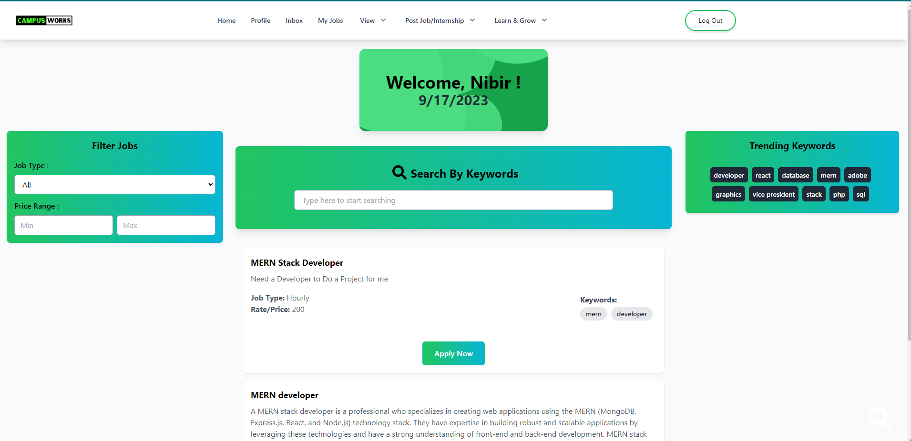

# 🔥 **CampusWorks - an on campus job and internship platform**
#       *Developed in MERN stack*
##   *Team Members*
##  *A Z Hasnain Kabir*
##  *Mamunur Rahman*
##  *Mukit Mahdin*

  

    
  

   

---

## **Our Goals**

* To provide a centralized and organized platform for managing freelance work and internships within the university community.
* To improve communication and tracking for clients and freelancers.
* To increase reliability and responsiveness in the system.
* To promote clarity and responsibility in the management of freelance orders, internships, and skill development opportunities.
* To make it easier for university students and alumni to find freelance work and internships opportunities
* To help clients to find suitable freelancers and interns faster and more effectively.

---

## **Type of Users and Portals :** 

2 Types of Users in Freelance Work Portal: 
-> Freelancers
-> Clients

2 Types of Users in the Internship Portal:
-> Job Seeker
-> Employer

1 type of user in the Online Forum:
-> Users can discuss interview questions, and relevant jobs and ask questions to obtain relevant information.

---

## 📝 **Features**

# *Features for IUTIAN Freelancers :* 
Advanced search capabilities: 
Job matching:  
Profile management: From a job seeker’s perspective 
Proposal management: Submit Proposal  
Payment and invoicing: Receiving payment  
Messaging and collaboration tools:  

# *Features for Clients :* 
Profile management: Client profile  
Reviews and ratings: Provide reviews  
Review proposals:  
Messaging and collaboration tools:   
Skill-based freelance searching based on keywords  

# *Features in Internship Portal :* 
Posting and Searching Job  
Job matching:  
Profile management: From a job seeker’s perspective  
Proposal management: Submit Proposal  
Messaging and collaboration tools:  

# *Features in Forum :* 
Online discussion platform related to jobs and internships.  

# **Screenshots**

# *Landing Page*

# *Jobs*

# *Job search*

# *Posting Jobs*

# *Profile*

# *Send Proposal*

# *Forum*

# *View Jobs posted by user*

